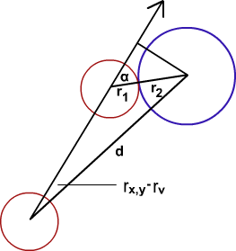

## Theory 

The abrupt change to the path of a moving body (or bodies) due to its interaction with other body (or bodies) is called collision. The magnitude and direction of the velocity of the colliding bodies may change in a collision. The force involved in collision may be large, but it acts only for a very short time. We come across many examples of collision daily. The coins of a carom game colliding with one another or collision between two automobiles in a road accident etc. are examples of collision. The Conservation Laws applied here are:

1. **Law of conservation of linear momentum:** Total linear momentum of a system of particle is conserved if no external force acts on the system. i.e., total linear momentum before collision is equal to total linear momentum after collision, if no external force acts on the system.
2. **Law of conservation of energy:** Energy can neither be created nor destroyed. But can be converted from one form to other.
 

### Types of collision:
 
1. **Elastic collision**: Collisions in which both momentum and kinetic energy of the system are conserved are called elastic collisions. The collision between subatomic particles is generally elastic. The collision between two steel or glass balls is nearly elastic. In elastic collisions, the forces involved during interaction are of conservative in nature.
2. **Inelastic collision**: Collisions in which momentum of the system is conserved but not the kinetic energy are called inelastic collisions. Most collision in everyday life is inelastic.
 

**Centre of mass of a system of particles**: Every physical system has associated with a certain point whose motion characterises that of the system as a whole. When the system moves under an external force then this point moves in the same way as a single particle would move under the same external force. This point is called centre of mass of the system. The motion of the system can be described in terms of the motion of its centre of mass.
 

### Formulas used:
 

#### Elastic and Inelastic Collision in Two Dimensions:

Here for the determination of the 'impact angle', the hard sphere model which obviously would only be an approximation for charged particles (strictly speaking the Rutherford scattering formula would have to be used for this). Apart from this, the solution below is a completely general and exact description of a 2D collision event (and in any case it provides exact conservation of momentum and energy). The relationship between the velocities of masses m1 and m2 before the collision (unprimed) and after the collision (primed) is given by the conservation equations for momentum and energy:

$$m_{1}v_{x,1}=m_{1}v_{x,1'}+m_{2}\Delta v_{x,2'}..............(1)$$
$$m_{1}v_{y,1}=m_{1}v_{y,1'}+m_{2}\Delta v_{x,2'}\tan (\theta)............(2)$$
$$\frac{m_{1}}{2}(v_{x,12}+v_{y,12})=\frac{m_{1}}{2}(v_{x,1'2})+\frac{m_{2}}{2}\Delta v_{x,2'2}(1+\tan (2\theta)).....(3)$$

For the sake of simplicity it has been assumed here that mass 2 is initially resting i.e. vx,2=0, vy,2=0 and $v_{x,2'}=\Delta v_{x,2'}$ (this does not affect the general validity of the final result as the assumption will be dropped again later by referring the velocities to mass 2 explicitly). The angle $\theta$¸ in Eq.(2) (and (3)) is the angle of the final velocity vector of ball 2 with the x-axis. This will be determined separately later from the geometry of the collision (alternatively, one can also treat $\theta$¸ as a free parameter). Solving now Eq.(1) for $v_{x,1'}$ and Eq.(2) for $v_{y,1'}$ yields

$$v_{x,1'}=v_{x,1}-\frac{m_{2}}{m_{1}}\Delta v_{x,2'}........(4)$$
$$v_{y,1'}=v_{y,1}-\frac{m_{2}}{m_{1}}\Delta v_{x,2'}\tan (\theta)............(5)$$

Inserting (4) and (5) into Eq.(3) results in a quadratic equation for $\Delta v_{x,2'}$ which (after some lengthy but straightforward algebraic manipulations) yields the solution:

$$\Delta v_{x,2'}=\frac{2[v_{x,1}+\tan (\theta)v_{y,1}]}{[(1+\tan^{2}\theta])(1+\frac{m_{2}}{m_{1}})]}........(6)$$

Refering now the initial velocities explicitly to ball 2 and noting that the angle $\theta$¸ is the sum of the relative velocity angle between ball 1 and 2

$$Yv=\arctan \left[ \frac{(v_{y,1}-v_{y,2})}{(v_{x,1}-v_{x,2})} \right]..........(7)$$

and the impact angle $\theta$ (see below); one can finally write

$$\Delta v_{x,2'}=\frac{2[v_{x,1}-v_{y,2}+a.(v_{y,1}-v_{y,2})]}{[(1+a^{2})(1+\frac{m_{2}}{m_{1}})]}......(8)$$

where

$$a=\tan (\theta)=\tan (Yv+\alpha)..................(9)$$

The 'impact angle' $\theta$ can vary between $-90^{0}$ and $+90^{0}$ (or $\frac{-\pi}{2}$ and $\frac{\pi}{2}$ when using radians) ($0^{0}$ corresponds to a head-on- and the extreme values to a grazing collision). (in most treatments of collision problems, the center-of -mass scattering angle $\theta$ is used, which relates to $\theta$ through $\theta=(\pi-\theta)/2; however, as $\theta$ is independent of the reference frame, it is a much better choice here). The actual value of$\theta$ depends on the exact coordinates of the particles, so if the latter are not known, one has to treat $\theta$ as a free parameter and generate it for instance through a random number generator. (otherwise see below for the determination of $\theta$). From Eqs.(2),(4),(5),(8),and (9) the velocity components after the collision are therefore:

$$v_{x,2'}=v_{x,2}+\Delta v_{x,2'}...............(10)$$
$$v_{y,2'}=v_{y,2}+a.\Delta v_{x,2'}...............(11)$$
$$v_{x,1'}=v_{x,1}-\frac{m_{2}}{m_{1}}\Delta v_{x,2'}...............(12)$$
$$v_{y,1'}=v_{y,1}-a.\frac{m_{2}}{m_{1}}\Delta v_{x,2'}...............(13)$$

The 'impact angle' $\alpha$ in Eq.(9) can be determined from the collision geometry as shown in the illustration below:

  

 

Geometry of 2D collision

If the coordinates of the balls (with radius $r_{1}$ and $r_{2}$ ) are x1,y1 and x2,y2, $\alpha$ is given by

$$\alpha=\arcsin\left[ \frac{d.\sin(Y_{x,y}-Y_{v})}{(r_{1}+r_{2})}\right]................(14)$$

Where

$$d=\sqrt{(x2-x1)^{2}+(y2-y1)^{2}}.............(15)$$

$$Y_{x,y}=\arcsin\left[ \frac{(y2-y1)}{(x2-x1)} \right].................(16)$$

This will give a value for $\alpha$ as long as the absolute value of $d.sin (Y_{x,y}-Y_{v})\le (r_{1}+r_{2})$ (otherwise the arcsin- function above is not defined, in which case the balls would not collide anyway). Note that one also has to exclude the case where $Y_{x,y}$ and $Y_{v}$ differ by more then $\pi/2$ and less than $1.5*\pi$ as then the balls would move away from each other. If one is tracking the balls for further collisions, it is also necessary to update the coordinates in addition to the velocities. This is achieved as follows: using the law of cosines for the collision triangle and solving the corresponding quadratic equation for the distance which ball 1 travels to the collision point, one obtains the time that elapses from the original coordinates to the collision as

$$t=\frac{d\cdot \cos(Y_{x,y}-Y_{v})\pm \sqrt{(r_{1}+r_{2})^{2}-[d.\sin(Y_{x,y}-Y_{v})]^{2}}}{\sqrt{(v_{x,1}-v_{x,2})^{2}+(v_{y,1}-v_{y})^{2}}}.........(17)$$

Before the first square root, the minus sign holds if $\cos(Y_{x,y} - Y_{v}) > 0$ and the plus sign otherwise. Note again that a valid solution requires $d \cdot \sin(Y_{x,y} - Y_{v})| \le (r_1 + r_2)$ (otherwise the balls would not collide). The new coordinates (the position of the center of the balls at the moment of collision) are therefore;

$$x_{1}'=x_{1}+v_{x,1}.t...................(18)$$

$$y_{1}'=y_{1}+v_{y,1}.t...................(19)$$

$$x_{2}'=x_{2}+v_{x,2}.t...................(20)$$

$$y_{2}'=y_{2}+v_{y,2}.t...................(21)$$

### Generalization to Inelastic Collisions:

The generalization of the above formulae to inelastic collisions is ultimately simple: we just have to refer the velocity components (Eq.(10)-(13)) to the center of mass reference frame, apply the restitution coefficient to these, and add again the center of mass ($cm$) velocity to return to the lab frame, i.e. with,

$$v_{x,cm}=\frac{(m1.v_{x,1}+m2.v_{x,2})}{(m1+m2)}.............(22)$$

$$v_{y,cm}=\frac{(m1.v_{y,1}+m2.v_{y,2})}{(m1+m2)}...............(23)$$

We have, 

$$v_{x,1}''=(v_{x,1}'-v_{x,cm}).R+v_{x,cm}...............(24)$$

$$v_{y,1}''=(v_{y,1}'-v_{y,cm}).R+v_{y,cm}...............(25)$$

$$v_{x,2}''=(v_{x,2}'-v_{x,cm}).R+v_{x,cm}................(26)$$

$$v_{y,2}''=(v_{y,2}'-v_{y,cm}).R+v_{y,cm}..............(27)$$

where R is the restitution coefficient (=1 for a perfectly elastic collision; =0 for a perfectly inelastic collision (balls stick together after the collision).

### Applications:
1. It is used for mobile networking.
2. Billard balls.
3. Cryptosystems.
4. Collision detection.
 

